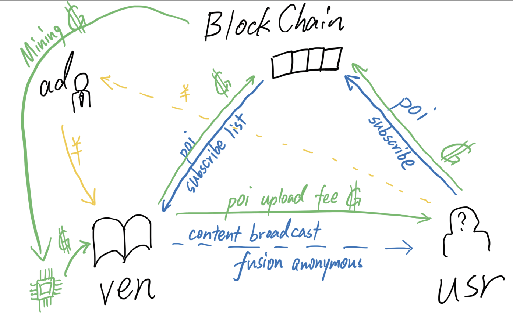

# WINDS 风闻

WINDS是*WINDS Is Not a Digital Spy*（WINDS不是数字间谍！）的递归缩写。

我们关心用户的隐私，并坚信这一需求能以不伤害内容提供者利益的方式完成。

该项目旨在改进现有的个性化推荐技术并推动它的发展。

## 愿景

### 在用户与内容提供者间建立一种**安全、透明**的双赢信息交易纽带：

1. 对于数据挖掘算法的受众（App用户）而言，可以免费、主动地从商家处收到自己感兴趣方面的信息推送，同时不必担心个人隐私被窃取、进而被滥用。
2. 对于商家，个性化推送算法仍然能沿用，亦消除了用户隐私处理不当带来的信誉风险。商家通过包括且不限于广告投送的方式盈利。
3. 同时，技术提供方可提供代理记账等服务获得一定收益，以此支持此类技术的演进。

### 促进区块链技术发展、落地：

## 资源流动

### 信息

信息在用户，区块链，内容商之前流动。用户把自己的兴趣点和订阅内容传到区块链上，区块链再将此身份的兴趣点和订阅内容提供给内容商，内容商便能
把订阅内容以混淆的方法匿名广播出去，传给用户。信息的传递需要代币支撑。

### 代币

用户，区块链，内容商之间的信息传递需要消耗代币，代币总额就会减少。\
内容商需要通过维护网络获得代币来维持代币流通。

### 现金

广告商支付内容商广告植入费用，将广告推送给用户，如此为广告商带来潜在利益。

## 各终端细节

### 智能合约

'''
push(): called by usr, broadcast point of interest or send content refresh request \
        called by ven, release content update \
\
subscribes: abi table, full (un)subscribe history \
additem(ven,sub): called by usr, new usr-ven info update (records are always increasing) \
getbypk (key): get key'th record \
getbyusr(usr): get usr's full record \
getbyven(ven): get ven's full record
'''

客户端管理用户的各个身份分离式调用 push() 和 subscribes.additem() 进行兴趣词广播和订阅操作。 \
客户端保证各身份在行为上彼此独立，合约为用户提供匿名性。

### 客户端

### 服务端

## 可调节参数
